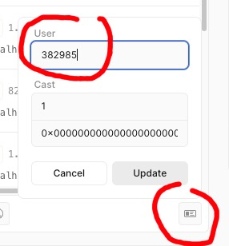

Dev page at http://localhost:3000/api/dev

To properly test it, first, set your farcaster user id.

Following the image below, press the icon (at the left side, below the route
history), then use your farcaster id.

